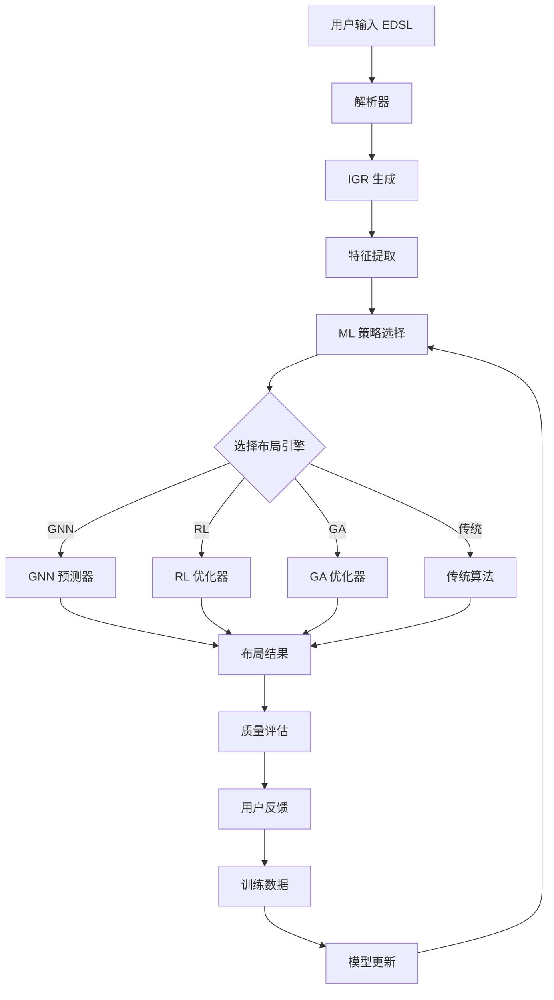

# 基于机器学习的布局增强设计规范

## 执行摘要

本文档提出了一个基于机器学习（ML）的综合解决方案，用于增强 Excalidraw-DSL 的自动布局系统。通过集成图神经网络（GNN）、强化学习（RL）、遗传算法（GA）和神经约束满足等先进技术，我们旨在显著提升图形布局的质量、性能和用户满意度。

### 核心价值主张

- **智能化布局预测**：基于历史数据和用户偏好自动优化布局
- **自适应性能优化**：根据图形复杂度动态选择最优算法
- **持续学习改进**：通过用户反馈不断提升布局质量
- **多目标优化**：同时考虑美观性、可读性和性能指标

## 背景与动机

### 现有挑战

当前的 Excalidraw-DSL 布局系统主要依赖传统算法（Dagre、ELK、Force-directed），存在以下局限性：

1. **静态算法选择**：无法根据图形特征自动选择最优算法
2. **参数调优困难**：需要手动调整大量参数以获得理想效果
3. **缺乏学习能力**：无法从用户交互和反馈中学习改进
4. **性能瓶颈**：复杂图形的布局计算时间过长
5. **美观性不足**：难以生成符合人类审美的自然布局

### 机器学习的机遇

机器学习技术在图形布局领域展现出巨大潜力：

- **模式识别**：自动识别图形结构模式并应用相应策略
- **预测能力**：基于部分信息预测完整布局
- **优化效率**：通过学习避免重复计算，加速布局过程
- **个性化**：根据用户偏好定制布局风格

## 现有系统分析

### 架构概览

```rust
// 当前布局系统架构
pub trait LayoutEngine {
    fn layout(&self, igr: &mut IntermediateGraph) -> Result<()>;
    fn name(&self) -> &'static str;
}

pub trait LayoutStrategy {
    fn apply(&self, igr: &mut IntermediateGraph, context: &LayoutContext) -> Result<()>;
    fn supports(&self, igr: &IntermediateGraph) -> bool;
}
```

### 主要组件

1. **LayoutManager**：协调不同布局引擎的中央管理器
2. **LayoutEngine 实现**：
   - DagreLayout：分层布局算法
   - ElkLayout：Eclipse 布局内核
   - ForceLayout：力导向布局
3. **LayoutStrategy**：策略模式实现，支持组合和自适应
4. **LayoutCache**：基于键值的布局缓存系统

### 性能分析

基于基准测试数据：

- 小型图形（<50节点）：平均 10-50ms
- 中型图形（50-200节点）：平均 50-200ms
- 大型图形（>200节点）：可能超过 1秒

### 质量评估指标

- **边交叉数**：影响可读性的关键指标
- **节点重叠**：必须避免的布局缺陷
- **空间利用率**：布局的紧凑程度
- **对称性**：美观性的重要因素
- **路径长度**：连接线的总长度

## ML解决方案提议

### 1. 图神经网络（GNN）布局预测

#### 架构设计

```rust
pub struct GNNLayoutPredictor {
    model: Arc<dyn GNNModel>,
    feature_extractor: FeatureExtractor,
    position_decoder: PositionDecoder,
}

impl GNNLayoutPredictor {
    pub fn predict_layout(&self, graph: &IntermediateGraph) -> Result<LayoutPrediction> {
        // 1. 提取图特征
        let features = self.feature_extractor.extract(graph)?;

        // 2. GNN 前向传播
        let embeddings = self.model.forward(&features)?;

        // 3. 解码位置信息
        let positions = self.position_decoder.decode(&embeddings)?;

        Ok(LayoutPrediction { positions, confidence: 0.95 })
    }
}
```

#### 特征工程

- **节点特征**：
  - 类型编码（组件、容器、组等）
  - 标签嵌入（使用预训练语言模型）
  - 度数统计（入度、出度）
  - 局部拓扑特征

- **边特征**：
  - 连接类型（箭头样式、方向）
  - 标签信息
  - 权重（可选）

- **全局特征**：
  - 图规模（节点数、边数）
  - 密度指标
  - 连通性特征
  - 层次结构深度

#### 模型架构

采用 GraphSAGE 或 GAT（图注意力网络）架构：

```python
class LayoutGNN(nn.Module):
    def __init__(self, input_dim, hidden_dim, output_dim, num_layers=3):
        super().__init__()
        self.convs = nn.ModuleList([
            GATConv(input_dim if i == 0 else hidden_dim,
                   hidden_dim, heads=4)
            for i in range(num_layers)
        ])
        self.position_head = nn.Linear(hidden_dim, 2)  # x, y coordinates
        self.confidence_head = nn.Linear(hidden_dim, 1)

    def forward(self, x, edge_index):
        for conv in self.convs:
            x = F.relu(conv(x, edge_index))
            x = F.dropout(x, p=0.1, training=self.training)

        positions = self.position_head(x)
        confidence = torch.sigmoid(self.confidence_head(x))

        return positions, confidence
```

### 2. 强化学习优化框架

#### 环境定义

```rust
pub struct LayoutEnvironment {
    graph: IntermediateGraph,
    current_positions: HashMap<NodeId, Position>,
    quality_evaluator: QualityEvaluator,
}

impl Environment for LayoutEnvironment {
    type State = LayoutState;
    type Action = LayoutAction;
    type Reward = f64;

    fn step(&mut self, action: Self::Action) -> (Self::State, Self::Reward, bool) {
        // 执行布局动作
        self.apply_action(action);

        // 计算奖励
        let reward = self.calculate_reward();

        // 检查终止条件
        let done = self.is_terminal();

        (self.get_state(), reward, done)
    }
}
```

#### 动作空间

- **节点移动**：调整单个节点位置
- **群组对齐**：对齐相关节点组
- **间距调整**：修改全局或局部间距
- **旋转变换**：旋转子图以优化布局
- **层次调整**：在分层布局中调整层次

#### 奖励函数

```rust
fn calculate_reward(&self) -> f64 {
    let mut reward = 0.0;

    // 边交叉惩罚
    reward -= self.count_edge_crossings() as f64 * 0.1;

    // 节点重叠惩罚
    reward -= self.calculate_overlap_penalty() * 0.5;

    // 空间利用率奖励
    reward += self.calculate_space_utilization() * 0.2;

    // 对称性奖励
    reward += self.calculate_symmetry_score() * 0.15;

    // 美观性综合评分
    reward += self.calculate_aesthetic_score() * 0.3;

    reward
}
```

#### 策略网络

使用 PPO（Proximal Policy Optimization）算法：

```python
class LayoutPolicy(nn.Module):
    def __init__(self, state_dim, action_dim, hidden_dim=256):
        super().__init__()
        self.actor = nn.Sequential(
            nn.Linear(state_dim, hidden_dim),
            nn.ReLU(),
            nn.Linear(hidden_dim, hidden_dim),
            nn.ReLU(),
            nn.Linear(hidden_dim, action_dim)
        )
        self.critic = nn.Sequential(
            nn.Linear(state_dim, hidden_dim),
            nn.ReLU(),
            nn.Linear(hidden_dim, hidden_dim),
            nn.ReLU(),
            nn.Linear(hidden_dim, 1)
        )

    def forward(self, state):
        action_probs = F.softmax(self.actor(state), dim=-1)
        value = self.critic(state)
        return action_probs, value
```

### 3. 遗传算法全局优化

#### 染色体编码

```rust
#[derive(Clone)]
pub struct LayoutChromosome {
    positions: Vec<(f64, f64)>,     // 节点位置
    algorithm_choice: LayoutAlgorithm, // 选择的布局算法
    parameters: HashMap<String, f64>,  // 算法参数
}

impl Chromosome for LayoutChromosome {
    fn fitness(&self, graph: &IntermediateGraph) -> f64 {
        let quality = evaluate_layout_quality(graph, &self.positions);
        let performance = estimate_performance(&self.algorithm_choice, &self.parameters);

        // 多目标优化：质量和性能的权衡
        0.7 * quality + 0.3 * performance
    }
}
```

#### 遗传操作

```rust
impl GeneticOperator for LayoutGA {
    fn crossover(&self, parent1: &LayoutChromosome, parent2: &LayoutChromosome) -> LayoutChromosome {
        // 位置交叉：使用部分映射交叉（PMX）
        let positions = pmx_crossover(&parent1.positions, &parent2.positions);

        // 算法选择：随机继承
        let algorithm = if rand::random() { parent1.algorithm_choice } else { parent2.algorithm_choice };

        // 参数混合：加权平均
        let parameters = blend_parameters(&parent1.parameters, &parent2.parameters, 0.5);

        LayoutChromosome { positions, algorithm, parameters }
    }

    fn mutate(&self, chromosome: &mut LayoutChromosome, rate: f64) {
        // 位置突变：高斯扰动
        for pos in &mut chromosome.positions {
            if rand::random::<f64>() < rate {
                pos.0 += rand_normal(0.0, 10.0);
                pos.1 += rand_normal(0.0, 10.0);
            }
        }

        // 参数突变：自适应调整
        for (_, value) in &mut chromosome.parameters {
            if rand::random::<f64>() < rate {
                *value *= rand::random::<f64>() * 0.4 + 0.8; // 80% - 120%
            }
        }
    }
}
```

### 4. 神经约束满足系统

#### 约束定义

```rust
pub enum LayoutConstraint {
    MinDistance { node1: NodeId, node2: NodeId, distance: f64 },
    Alignment { nodes: Vec<NodeId>, axis: Axis },
    Containment { container: NodeId, children: Vec<NodeId> },
    Ordering { nodes: Vec<NodeId>, direction: Direction },
    FixedPosition { node: NodeId, position: Position },
}

pub struct NeuralConstraintSolver {
    encoder: ConstraintEncoder,
    solver_network: SolverNetwork,
    decoder: SolutionDecoder,
}
```

#### 神经求解器架构

```python
class ConstraintSolverNet(nn.Module):
    def __init__(self, input_dim, hidden_dim, max_iterations=10):
        super().__init__()
        self.max_iterations = max_iterations

        # 约束编码器
        self.constraint_encoder = nn.LSTM(input_dim, hidden_dim, batch_first=True)

        # 迭代求解器（使用 GRU 单元）
        self.solver_gru = nn.GRU(hidden_dim, hidden_dim)

        # 位置预测器
        self.position_predictor = nn.Sequential(
            nn.Linear(hidden_dim, hidden_dim),
            nn.ReLU(),
            nn.Linear(hidden_dim, 2)
        )

        # 可行性预测器
        self.feasibility_predictor = nn.Linear(hidden_dim, 1)

    def forward(self, constraints, initial_positions):
        # 编码约束
        encoded, _ = self.constraint_encoder(constraints)

        # 迭代求解
        hidden = self.init_hidden(initial_positions)

        for _ in range(self.max_iterations):
            hidden, _ = self.solver_gru(encoded, hidden)

            # 预测新位置
            positions = self.position_predictor(hidden)

            # 检查可行性
            feasibility = torch.sigmoid(self.feasibility_predictor(hidden))

            if feasibility.mean() > 0.95:
                break

        return positions, feasibility
```

### 5. ML驱动的策略选择器

#### 元学习框架

```rust
pub struct MLStrategySelector {
    feature_extractor: GraphFeatureExtractor,
    performance_predictor: PerformancePredictor,
    quality_predictor: QualityPredictor,
    strategy_selector: StrategySelector,
}

impl MLStrategySelector {
    pub fn select_strategy(&self, graph: &IntermediateGraph) -> LayoutStrategy {
        // 提取图特征
        let features = self.feature_extractor.extract(graph);

        // 预测每种策略的性能
        let performance_predictions = self.predict_performance(&features);

        // 预测每种策略的质量
        let quality_predictions = self.predict_quality(&features);

        // 多目标优化选择
        self.strategy_selector.select(
            &performance_predictions,
            &quality_predictions,
            &self.user_preferences
        )
    }
}
```

#### 特征向量

```rust
pub struct GraphFeatures {
    // 结构特征
    node_count: usize,
    edge_count: usize,
    density: f64,
    clustering_coefficient: f64,

    // 拓扑特征
    max_degree: usize,
    avg_degree: f64,
    diameter: usize,
    connected_components: usize,

    // 层次特征
    hierarchy_depth: usize,
    avg_children_per_container: f64,
    nesting_complexity: f64,

    // 语义特征
    node_type_distribution: HashMap<String, f64>,
    edge_type_distribution: HashMap<String, f64>,
    label_embeddings: Vec<f64>,
}
```

## 技术架构

### 系统架构图

```text
┌─────────────────────────────────────────────────────────────┐
│                        用户接口层                             │
│  ┌─────────────┐  ┌──────────────┐  ┌──────────────────┐   │
│  │  EDSL 解析器 │  │  Web UI      │  │  CLI 接口        │   │
│  └─────────────┘  └──────────────┘  └──────────────────┘   │
└─────────────────────────────────────────────────────────────┘
                               │
┌─────────────────────────────────────────────────────────────┐
│                      ML 布局协调器                           │
│  ┌─────────────────────────────────────────────────────┐   │
│  │           智能策略选择器 (MLStrategySelector)         │   │
│  │  ┌──────────┐  ┌──────────┐  ┌──────────────────┐  │   │
│  │  │特征提取器 │  │性能预测器 │  │质量预测器        │  │   │
│  │  └──────────┘  └──────────┘  └──────────────────┘  │   │
│  └─────────────────────────────────────────────────────┘   │
└─────────────────────────────────────────────────────────────┘
                               │
┌─────────────────────────────────────────────────────────────┐
│                      ML 布局引擎层                           │
│  ┌──────────────┐  ┌──────────────┐  ┌────────────────┐   │
│  │ GNN预测器    │  │ RL优化器     │  │ GA全局优化器   │   │
│  └──────────────┘  └──────────────┘  └────────────────┘   │
│  ┌──────────────┐  ┌──────────────┐  ┌────────────────┐   │
│  │约束求解器    │  │传统布局引擎   │  │混合策略引擎    │   │
│  └──────────────┘  └──────────────┘  └────────────────┘   │
└─────────────────────────────────────────────────────────────┘
                               │
┌─────────────────────────────────────────────────────────────┐
│                      数据与模型层                            │
│  ┌──────────────┐  ┌──────────────┐  ┌────────────────┐   │
│  │训练数据管理  │  │模型存储      │  │用户反馈收集    │   │
│  └──────────────┘  └──────────────┘  └────────────────┘   │
└─────────────────────────────────────────────────────────────┘
```

### 核心组件设计

#### 1. ML 布局协调器

```rust
pub struct MLLayoutCoordinator {
    strategy_selector: Arc<MLStrategySelector>,
    layout_engines: HashMap<String, Arc<dyn LayoutEngine>>,
    performance_monitor: PerformanceMonitor,
    quality_evaluator: QualityEvaluator,
    feedback_collector: FeedbackCollector,
}

impl MLLayoutCoordinator {
    pub async fn layout(&self, graph: &mut IntermediateGraph) -> Result<LayoutResult> {
        // 1. 选择最优策略
        let strategy = self.strategy_selector.select_strategy(graph).await?;

        // 2. 执行布局
        let start_time = Instant::now();
        let layout_result = strategy.apply(graph).await?;
        let duration = start_time.elapsed();

        // 3. 评估结果
        let quality_metrics = self.quality_evaluator.evaluate(graph)?;

        // 4. 收集性能数据
        self.performance_monitor.record(
            &strategy.name(),
            duration,
            &quality_metrics
        );

        // 5. 准备用户反馈收集
        self.feedback_collector.prepare_feedback_session(
            graph,
            &layout_result,
            &quality_metrics
        );

        Ok(layout_result)
    }
}
```

#### 2. 模型管理系统

```rust
pub struct ModelManager {
    model_registry: ModelRegistry,
    model_loader: ModelLoader,
    update_scheduler: UpdateScheduler,
    version_controller: VersionController,
}

impl ModelManager {
    pub async fn load_model(&self, model_type: ModelType) -> Result<Arc<dyn Model>> {
        // 检查缓存
        if let Some(cached) = self.model_registry.get_cached(&model_type) {
            return Ok(cached);
        }

        // 加载最新版本
        let version = self.version_controller.get_latest_version(&model_type)?;
        let model = self.model_loader.load(&model_type, &version).await?;

        // 注册到缓存
        self.model_registry.register(model_type, model.clone());

        Ok(model)
    }

    pub async fn update_models(&self) -> Result<()> {
        // 检查更新
        let updates = self.update_scheduler.check_updates().await?;

        for update in updates {
            // 下载新模型
            let new_model = self.download_model(&update).await?;

            // A/B 测试验证
            if self.validate_model(&new_model).await? {
                self.model_registry.update(update.model_type, new_model);
            }
        }

        Ok(())
    }
}
```

#### 3. 训练数据收集器

```rust
pub struct TrainingDataCollector {
    data_buffer: Arc<Mutex<DataBuffer>>,
    anonymizer: DataAnonymizer,
    quality_filter: QualityFilter,
    storage: DataStorage,
}

impl TrainingDataCollector {
    pub async fn collect(&self, session: LayoutSession) -> Result<()> {
        // 匿名化处理
        let anonymized = self.anonymizer.process(&session)?;

        // 质量过滤
        if !self.quality_filter.is_valid(&anonymized) {
            return Ok(());
        }

        // 添加到缓冲区
        self.data_buffer.lock().await.add(anonymized);

        // 批量持久化
        if self.data_buffer.lock().await.should_flush() {
            self.flush_to_storage().await?;
        }

        Ok(())
    }
}
```

### 数据流设计



## 实施路线图

### 第一阶段：基础设施（2-3个月）

1. **ML 框架集成**
   - 集成 PyTorch/ONNX Runtime
   - 建立 Rust-Python 互操作层
   - 实现模型加载和推理框架

2. **特征工程系统**
   - 实现图特征提取器
   - 建立特征缓存机制
   - 开发特征标准化流程

3. **数据收集框架**
   - 设计数据格式和存储方案
   - 实现匿名化和隐私保护
   - 建立数据质量控制流程

### 第二阶段：核心 ML 组件（3-4个月）

1. **GNN 布局预测器**
   - 实现基础 GNN 模型
   - 训练初始模型
   - 集成到布局管道

2. **ML 策略选择器**
   - 实现性能预测模型
   - 开发质量预测模型
   - 建立多目标优化框架

3. **基础评估系统**
   - 实现质量度量指标
   - 开发性能基准测试
   - 建立 A/B 测试框架

### 第三阶段：高级优化（4-5个月）

1. **强化学习优化器**
   - 实现 RL 环境
   - 训练策略网络
   - 开发在线学习机制

2. **遗传算法框架**
   - 实现 GA 优化器
   - 开发并行化方案
   - 集成多目标优化

3. **约束求解系统**
   - 实现神经约束求解器
   - 开发约束语言
   - 集成用户自定义约束

### 第四阶段：生产就绪（2-3个月）

1. **性能优化**
   - 模型量化和压缩
   - 推理加速优化
   - 缓存策略改进

2. **部署系统**
   - 实现模型版本管理
   - 开发自动更新机制
   - 建立监控和告警

3. **用户体验**
   - 开发可视化调试工具
   - 实现交互式反馈界面
   - 创建性能仪表板

## 风险评估

### 技术风险

1. **模型性能风险**
   - **风险**：ML 模型可能比传统算法慢
   - **缓解**：实现模型压缩、量化和硬件加速
   - **概率**：中等
   - **影响**：高

2. **模型质量风险**
   - **风险**：生成的布局质量不稳定
   - **缓解**：保留传统算法作为后备，实现质量检查
   - **概率**：中等
   - **影响**：高

3. **训练数据不足**
   - **风险**：缺乏高质量训练数据
   - **缓解**：合成数据生成，迁移学习
   - **概率**：高
   - **影响**：中等

### 业务风险

1. **用户接受度**
   - **风险**：用户可能不信任 ML 生成的布局
   - **缓解**：提供透明度，允许手动调整
   - **概率**：中等
   - **影响**：中等

2. **维护复杂性**
   - **风险**：ML 系统增加维护负担
   - **缓解**：自动化测试，完善文档
   - **概率**：高
   - **影响**：中等

3. **计算资源需求**
   - **风险**：推理需要显著计算资源
   - **缓解**：边缘部署优化，云端卸载选项
   - **概率**：中等
   - **影响**：低

### 风险矩阵

| 风险类别 | 概率 | 影响 | 风险等级 | 缓解优先级 |
|---------|------|------|---------|-----------|
| 模型性能 | 中 | 高 | 高 | P0 |
| 模型质量 | 中 | 高 | 高 | P0 |
| 数据不足 | 高 | 中 | 高 | P1 |
| 用户接受 | 中 | 中 | 中 | P2 |
| 维护复杂 | 高 | 中 | 高 | P1 |
| 计算资源 | 中 | 低 | 低 | P3 |

## 成功指标

### 性能指标

1. **推理延迟**
   - 目标：< 100ms（中型图）
   - 基准：当前 50-200ms
   - 改进：2倍加速

2. **吞吐量**
   - 目标：> 1000 图/分钟
   - 测量：并发处理能力
   - 优化：批处理和缓存

3. **资源使用**
   - CPU：< 200% 平均使用率
   - 内存：< 500MB 峰值
   - GPU：可选，< 50% 使用率

### 质量指标

1. **布局美观度**
   - 边交叉减少：> 30%
   - 对称性提升：> 25%
   - 空间利用率：> 80%

2. **用户满意度**
   - 接受率：> 85%
   - 手动调整减少：> 50%
   - 反馈评分：> 4.5/5

3. **算法准确性**
   - 策略选择准确率：> 90%
   - 性能预测误差：< 15%
   - 质量预测相关性：> 0.8

### 业务指标

1. **采用率**
   - 月活跃用户增长：> 20%
   - ML 功能使用率：> 60%
   - 付费转化提升：> 15%

2. **开发效率**
   - 布局调整时间减少：> 70%
   - 首次成功率提升：> 40%
   - 支持工单减少：> 30%

3. **系统可靠性**
   - 可用性：> 99.9%
   - 错误率：< 0.1%
   - 恢复时间：< 5分钟

## 监控与评估

### 实时监控指标

```rust
pub struct MLLayoutMetrics {
    // 性能指标
    inference_latency: Histogram,
    throughput: Counter,
    cache_hit_rate: Gauge,

    // 质量指标
    edge_crossings: Histogram,
    node_overlaps: Counter,
    user_adjustments: Counter,

    // 模型指标
    prediction_confidence: Histogram,
    strategy_distribution: HashMap<String, Counter>,
    model_version: Gauge,

    // 用户指标
    satisfaction_score: Histogram,
    feature_usage: HashMap<String, Counter>,
    error_rate: Gauge,
}
```

### 评估框架

1. **离线评估**
   - 基准数据集测试
   - 回归测试套件
   - 性能基准对比

2. **在线评估**
   - A/B 测试框架
   - 用户反馈收集
   - 实时质量监控

3. **持续改进**
   - 自动模型更新
   - 增量学习机制
   - 反馈循环优化

## 结论

本设计文档提出了一个全面的机器学习增强布局系统，通过整合多种先进的 ML 技术，显著提升 Excalidraw-DSL 的布局质量和用户体验。实施这一系统将使我们在自动图形布局领域保持技术领先地位，同时为用户提供更智能、更高效的图形设计体验。

成功的关键在于：

1. 渐进式实施，确保系统稳定性
2. 持续收集用户反馈，迭代改进
3. 保持传统算法作为后备方案
4. 注重性能优化和用户体验

通过严格遵循本文档的设计和实施计划，我们有信心在 12-14 个月内交付一个生产就绪的 ML 增强布局系统。
